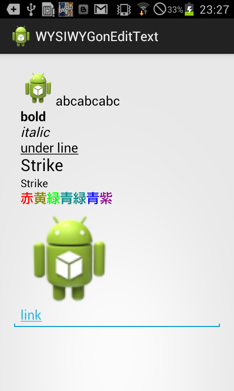

## screenshot


## code

```
EditText et = (EditText) findViewById(R.id.editText1);

// EditTextに画像を挿入したい その１
SpannableString ss = new SpannableString("abc");
Drawable d = getBaseContext().getResources().getDrawable(
        R.drawable.ic_launcher);
d.setBounds(0, 0, d.getIntrinsicWidth(), d.getIntrinsicHeight());
ImageSpan span = new ImageSpan(d, ImageSpan.ALIGN_BASELINE);
ss.setSpan(span, 0, 3, Spannable.SPAN_INCLUSIVE_EXCLUSIVE);
et.setText(ss);
// appendしてもなぜかabcとしか出ない
et.append(ss);
et.append(ss);
et.append(ss);

// 太文字
et.append(Html.fromHtml("<br /><b>bold</b>"));

// 斜体
et.append(Html.fromHtml("<br /><i>italic</i>"));

// 下線
et.append(Html.fromHtml("<br /><u>under line</u>"));

// big
et.append(Html.fromHtml("<br /><big>Strike</big>"));

// small
et.append(Html.fromHtml("<br /><small>Strike</small>"));

// color
et.append(Html.fromHtml("<br />" + "<font color='#ff0000'>赤</font>"
        + "<font color='#888800'>黄</font>"
        + "<font color='#00ff00'>緑</font>"
        + "<font color='#008888'>青緑</font>"
        + "<font color='#0000ff'>青</font>"
        + "<font color='#880088'>紫</font><br>"));

// EditTextに画像を挿入したい その２
Html.ImageGetter ig = new Html.ImageGetter() {
    public Drawable getDrawable(String source) {
        Drawable dr = getResources()
                .getDrawable(R.drawable.ic_launcher);

        // 大きさを指定できる
        dr.setBounds(0, 0, 200, 200);
        return dr;
    }
};

et.append(Html.fromHtml("", ig, null));

// Link
et.setMovementMethod(android.text.method.LinkMovementMethod
        .getInstance());
Spanned spanned = Html
        .fromHtml("<br /><a href='http://www.google.com/'>link</a>");
et.append(spanned);
```
